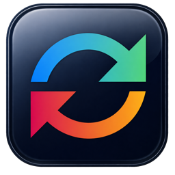
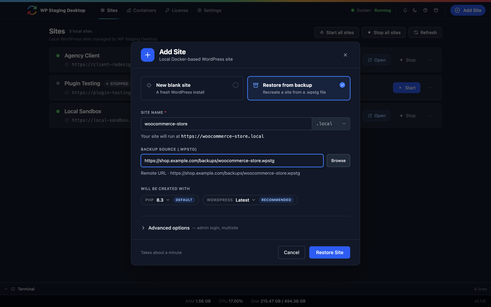
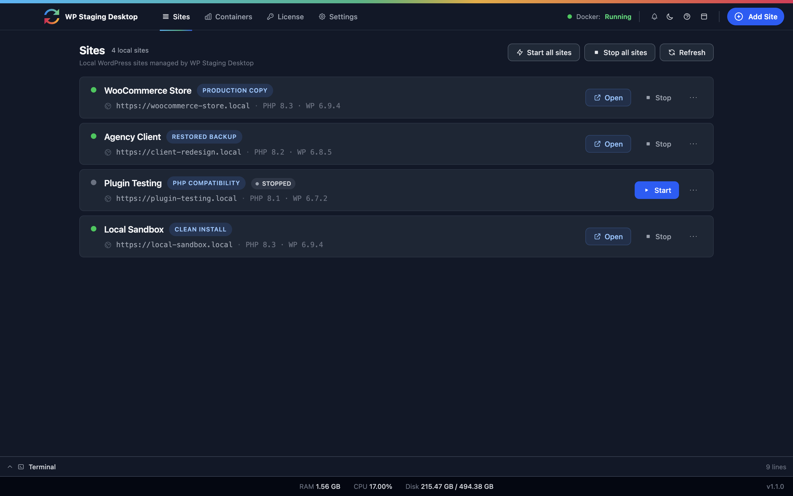
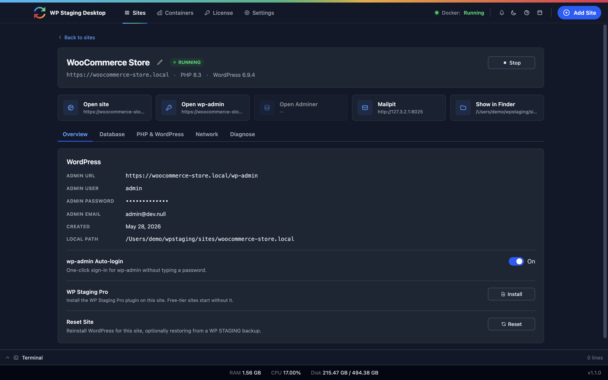

# WP Staging Desktop

### Turn a live WordPress site into a local development environment in minutes.

Clone a production website to your own machine, test risky changes safely, and switch PHP versions per site, all locally. **Free to use, not a trial. No manual Docker setup, no host lock-in, no account required to start.**

&nbsp;

&nbsp;

**[Download](https://github.com/wp-staging/wp-staging-desktop/releases/latest)** · **[Landing page](https://wp-staging.com/desktop)** · **[Documentation](docs/)** · **[Support](https://wp-staging.com/support/)**

---

▶ <strong>Watch the demo</strong> — a live site cloned to a local copy in about a minute.

Most WordPress work starts with an existing live site, not a blank install. Getting that site onto your computer safely is the slow, error-prone part: exporting databases, copying files, replacing URLs, fixing environment mismatches. WP Staging Desktop does it from a single portable backup file in about a minute.

## ⭐ Clone a production site to your machine, for free

From live site to local copy in four steps. Free, no account needed:

| | |
|---|---|
| **1. Create a backup** | On the live site, make a portable `.wpstg` file with the free [WP Staging plugin](https://wordpress.org/plugins/wp-staging/) from wordpress.org. |
| **2. Add a site** | In WP Staging Desktop, choose **Restore from backup**. |
| **3. Pick the `.wpstg` file** | Select the backup from your disk. (Pro can import straight from a backup URL.) |
| **4. Your site is ready** | Open it in the browser, or jump into `wp-admin` with **one-click auto-login**. |

The restored site runs locally with its real files, database, plugins, themes, and uploads. It is a true copy of production that you can break, test, and rebuild without ever touching the live website.

Add a site from a <code>.wpstg</code> backup.

## Why you'll want it

- 🚀 **Real sites in ~60 seconds.** Spin up a live-site copy or a clean install without configuring Docker by hand.
- 🧪 **Test risky changes safely.** Try plugin updates, PHP upgrades, or WooCommerce changes on a local copy, never on the revenue-generating store.
- 🔀 **Switch PHP versions per site.** Check compatibility across PHP 7.4–8.4 with a click.
- 🐳 **Docker you actually own.** Standard containers with readable docker-compose files that are yours to edit and reuse.
- 📴 **Works offline.** After install, your local work keeps going without any remote service.
- 🗂️ **Everything in one place.** Production copies, restored backups, compatibility tests, and clean installs, side by side.
- 🤖 **A real sandbox for AI coding agents.** Give Claude, Codex, or Cursor an actual running WordPress site to inspect, edit, and rebuild, instead of guessing from static files.

All your local sites, side by side.

## Free vs Pro

The free version is a **complete local development tool, not a trial.** Every local site runs with one-click `wp-admin` auto-login, PHP switching, and reset, with no license required. WP Staging Pro adds remote, production-connected workflows on top.

Manage each local site: one-click <code>wp-admin</code> auto-login, PHP/WordPress versions, and reset. Free-tier sites start without Pro.

| Feature | Desktop (Free) | Desktop + WP Staging Pro |
|---|:---:|:---:|
| Create local WordPress sites | ✅ | ✅ |
| Switch PHP versions per site | ✅ | ✅ |
| Docker-based local environments | ✅ | ✅ |
| Restore local `.wpstg` backups | ✅ | ✅ |
| Import a backup from a URL | — | ✅ |
| Connect to a live site and pull its data | — | ✅ |
| Deploy local changes to production | — | Push coming soon |
| Cloud backup workflows | — | ✅ |
| Support | Community | Priority |

**[Compare Free vs Pro →](https://wp-staging.com/desktop)** · **[Get WP Staging Pro →](https://wp-staging.com)**

## Why local, not host staging?

Staging tools inside a hosting account are convenient, but they stay remote and host-bound. WP Staging Desktop gives you a workflow you own:

| Host staging | WP Staging Desktop |
|---|---|
| Lives inside the hosting account | Runs on your machine |
| Usually remote only | Fully local environment |
| Host-dependent | Host-independent |
| Limited local debugging | Full debugging with your own tools |
| Hard to move between hosts | Portable `.wpstg` backup workflows |

## Installation

Download the installer for your platform from the **[Releases page](https://github.com/wp-staging/wp-staging-desktop/releases/latest)**.

### macOS
1. Download `wpstaging-desktop-{version}-mac-universal.dmg`.
2. Open the DMG and drag **WP Staging Desktop** into Applications.
3. Launch it from Applications. The app is signed with a Developer ID and notarized by Apple, so Gatekeeper opens it without warnings.

Runs natively on both Intel and Apple Silicon.

### Linux
1. Download `wpstaging-desktop-{version}-linux-x64.AppImage`.
2. Make it executable: `chmod +x wpstaging-desktop-*.AppImage`.
3. Run it: `./wpstaging-desktop-*.AppImage`.

Portable, no installation step needed.

### Windows
1. Download `wpstaging-desktop-{version}-win-x64-setup.exe` (installer) or `wpstaging-desktop-{version}-win-x64-portable.exe` (no installation needed).
2. Run the file and follow the steps.

If Microsoft SmartScreen shows a warning, click **More info**, then **Run anyway**. This is normal for a new app until it builds up a reputation with Microsoft.

### First launch
The first time you open the app, it downloads the wpstaging engine, the local component that powers site creation and management, and saves it to your user folder. You'll see a one-time progress screen. No administrator password is needed, and the engine reinstalls automatically if the file ever goes missing.

## Built on proven technology

WP Staging Desktop uses the same backup and restore engine as the [WP Staging plugin](https://wordpress.org/plugins/wp-staging/), refined for years on production WordPress sites.

| 2,000+ | PHP 7.4–8.4 | ~12 hrs | 100,000s |
|:---:|:---:|:---:|:---:|
| automated tests | version coverage | release validation | WordPress installs |

## The WP Staging ecosystem

| | |
|---|---|
| **[WP Staging plugin](https://wordpress.org/plugins/wp-staging/)** | Free on wordpress.org. Creates the portable `.wpstg` backups on your live site, the starting point of the clone workflow. |
| **WP Staging Desktop** | This app. Turns those backups into running local WordPress sites. |
| **[WP Staging Pro](https://wp-staging.com)** | Connects local development to production: pull live data, remote backups, cloud workflows. Bundled Pro plugin included. |
| **[WP Staging CLI](https://github.com/wp-staging/wp-staging-cli-release)** | The engine under Desktop, also usable standalone for scripted site creation in CI and AI agent workflows. |

## Requirements & documentation

- **[System Requirements](docs/SYSTEM-REQUIREMENTS.md)**: supported operating systems, Docker, hardware, and common problems.
- **[FAQ](docs/FAQ.md)**: frequently asked questions for end users.

## Support

Need help? Visit **[wp-staging.com/support](https://wp-staging.com/support/)**.

## License

Use of the official application is governed by the [End User License Agreement](EULA.md). The WP Staging Desktop GUI source code is source-available under the WP STAGING Desktop GUI Source-Available License (see [`LICENSE.md`](LICENSE.md) and [`NOTICE.md`](NOTICE.md)). The WP Staging Desktop Core (WP Staging Engine), license validation logic, entitlement system, activation service, update service, Pro feature execution logic, official distributed binaries, and cloud services are proprietary components. Third-party components remain governed by their own licenses. A valid [WP Staging Agency or Developer license](https://wp-staging.com) unlocks Pro features. See your license agreement at [wp-staging.com](https://wp-staging.com) for terms.

**Bring your WordPress production sites to your local machine.**

Available for macOS, Windows, and Linux. Free version included.

